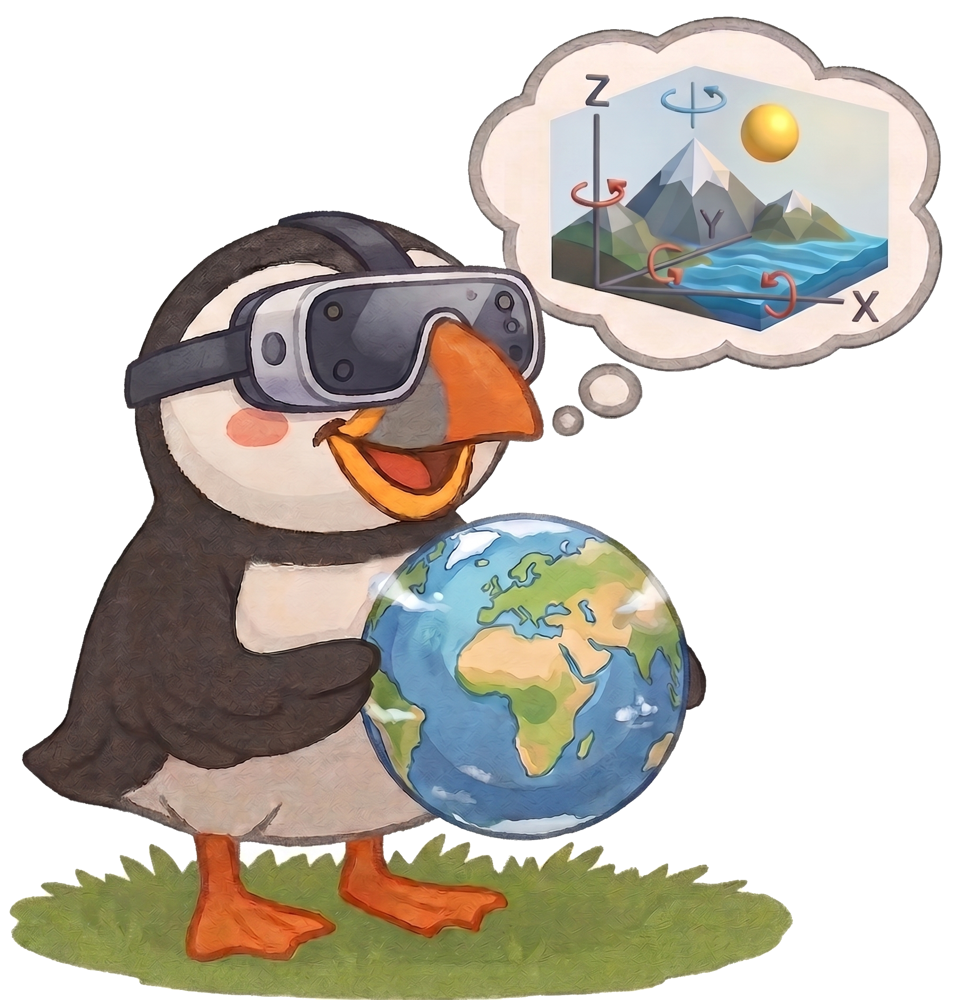

<h1>
  
  Puffin-World: Scaling a Unified Multimodal Model with Native 3D World States
</h1>

> **[Puffin-World: Scaling a Unified Multimodal Model with Native 3D World States](https://kangliao929.github.io/projects/puffin-world/)**
>
> [Kang Liao](https://kangliao929.github.io/), Yihang Luo, Xiao-Ming Wu, [Linyi Jin](https://jinlinyi.github.io/), [Size Wu](https://wusize.github.io/), Chunyu Lin, Yao Zhao, [Fei Wang](https://scholar.google.com/citations?user=ljt16JkAAAAJ&hl), [Wei Li](https://weivision.github.io/), [Chen Change Loy](https://www.mmlab-ntu.com/person/ccloy/index.html)

>
> [](https://kangliao929.github.io/projects/puffin-world/)
> [](https://huggingface.co/KangLiao/Puffin-World)
> [](https://huggingface.co/datasets/KangLiao/Puffin-16M)
> [](https://huggingface.co/datasets/KangLiao/Puffin)

## Introduction

We introduce **Puffin-World**, a unified multimodal world model that represents the
physical environment through three complementary **native 3D world states** —
**physics** (gravity-aware camera understanding and physically consistent trajectory
propagation), **geometry** (dense spatial structure for view synthesis and 3D
reconstruction), and **appearance** (high-fidelity, spatially coherent visual
content). A single integrated framework of vision encoder, LLM, and diffusion model
— without task-specific external modules — supports physical-world perception,
free-viewpoint spatial simulation, 3D world modeling, and closed-loop interaction.

At its core is camera-centric **multi-view world modeling**: given one initial view
and a camera trajectory, generate the remaining views (Stage III: RGB; Stage IV:
RGB + depth jointly, with 3D point-cloud reconstruction). Built on
[Puffin](https://github.com/KangLiao929/Puffin) (*Thinking with Camera*, ICLR 2026).

## 🖥️ Requirements and Installation

The code is implemented with **Python 3.10, PyTorch 2.7.0 and CUDA 12.6**.
The environment is named **`puffin-world`**; the steps below reproduce it
exactly (order matters — torch first, `flash-attn` compiles against it).

```bash
# git clone this repository
git clone https://github.com/KangLiao929/Puffin
cd Puffin/Puffin-World

# 1. create the env
conda create -n puffin-world python=3.10 -y
conda activate puffin-world

# 2. torch stack (cu126 index)
pip install torch==2.7.0 torchvision==0.22.0 torchaudio==2.7.0 \
    --index-url https://download.pytorch.org/whl/cu126

# 3. pinned python dependencies (includes transformers 5.3 / deepspeed /
#    xtuner / diffusers / trimesh and the utils3d git pin)
pip install -r requirements.txt

# 4. flash-attn (compiled against the torch above; ninja is in requirements)
pip install flash-attn==2.8.3 --no-build-isolation
```

Sanity check:

```bash
export PYTHONPATH=./:$PYTHONPATH
python -c "import torch, transformers, deepspeed, xtuner, flash_attn, trimesh; print('ok')"
```

## 🏋️ Training

The world model is trained in stages, each a config under
`configs/pipelines/` launched the same way (`torchrun + scripts/train.py
--deepspeed deepspeed_zero2`, wrapped by `scripts/train_ddp.sh` for
multi-node runs):

1. **Stage I / II — alignment & base SFT**: the camera-centric single-view
   foundation (understanding + generation).
2. **Stage III — world modeling (RGB)**: trajectory-controlled multi-view
   generation; initialized from the Stage II merged weights.
3. **Stage IV — world modeling (RGB + depth)**: joint depth generation with
   asymmetric attention (`rgb_blind_to_depth`), initialized from the
   Stage III merged weights.

```bash
torchrun --nproc_per_node=8 scripts/train.py \
    configs/pipelines/<stage_config>.py \
    --launcher pytorch --deepspeed deepspeed_zero2
```

Checkpoints rotate under `work_dirs/<exp>/iter_*.pth` (DeepSpeed
directories); merge one into a single `.pth` for the next stage or for
inference with:

```bash
python scripts/deepspeed2torch.py \
    --input work_dirs/<exp>/iter_XXXX.pth --output work_dirs/<exp>/model_XXk.pth
```

Full stage-by-stage recipes, dataset index caches, resuming and the
understanding-only VLM track: **`documents/TRAINING.md`**.

## 📊 Evaluation

### World model (Stage III / IV)

Quickest start — the single-sample demo (model by NAME, single GPU, no
accelerate; `--geometry off` runs Stage IV RGB-only, valid for the asym
checkpoints whose RGB pathway is attention-isolated from depth):

```bash
export PYTHONPATH=./:$PYTHONPATH
python scripts/demo/world_modeling.py \
    --model Puffin-World \
    --checkpoint work_dirs/<exp>/model_itrXXXX.pth \
    --dataset re10k --sample_index 0 --output output/demo_world
```

Full evaluation — one entry covers both stages,
`scripts/evaluation/generation_multi_view.py` (Stage IV
depth/reconstruction artifacts switch on automatically with the config's
`geometry_state`):

```bash
export PYTHONPATH=./:$PYTHONPATH
accelerate launch scripts/evaluation/generation_multi_view.py \
    configs/pipelines/<stage_config>.py \
    --checkpoint work_dirs/<exp>/iter_XXXX.pth \
    --dataset re10k dl3dv \
    --test_sceneids_path "dataset_summary/{dataset}_test_sceneid_50.pkl" \
    --sample_mode first --num_test_samples 50 \
    --cfg_scale 2 --height 640 --width 640 \
    --output output/<run_name>
```

The flow: pick a dataset (`re10k / dl3dv / puffin_omni / ...`) and either
random samples or the held-out 50-scene test splits; the script writes
per-sample GT/generated views, frame-aligned GIFs, the Genie-style
keyboard-control overlay, perspective-field visualizations and — for
Stage IV — depth maps plus a gauge-aligned `reconstruction.glb` point
cloud. Long trajectories via chunked autoregression (`--chunk`), motion
probing via custom (`--cus_traj`) and compound (`--combo_traj`)
trajectories. `cfg_scale=2` is the sweep-validated default.

All flags, output layout and the reconstruction/alignment details:
**`documents/EVALUATION_World.md`**.

### Camera-centric understanding & generation

Single-view camera estimation and camera-controlled generation evaluation
(GeoCalib-scored): **`documents/EVALUATION.md`**.

### Dataset construction & annotation

Pipeline and per-modality annotation stacks (camera captions, DA3 depth):
**`documents/DATASET_PIPELINE.md`**, **`documents/ANNOTATION_CAMERA.md`**,
**`documents/ANNOTATION_DEPTH.md`**.

<h2>
  
  Puffin-16M Dataset
</h2>

**Puffin-16M** comprises 15M vision-language-camera triplets and 1M diverse
camera trajectories curated from 28 public datasets, together with the
held-out benchmarks `Puffin-Cam-15M-Bench` and `Puffin-Traj-1M-Bench`:
🤗 [KangLiao/Puffin-16M](https://huggingface.co/datasets/KangLiao/Puffin-16M).

<p align="center">
  
</p>

## 📦 Data & Weights

We release three model variants in 🤗 [KangLiao/Puffin-World](https://huggingface.co/KangLiao/Puffin-World):

| Checkpoint | LLM | Vision encoder | Purpose |
|---|---|---|---|
| `Puffin-World-Base.pth` | Qwen2.5-7B | C-RADIOv3-H | unified world modeling |
| `Puffin-World-Pro.pth` | Qwen2.5-1.5B | C-RADIOv4-H | unified world modeling |
| `Puffin-World-Caption.pth` | Qwen3.5-0.8B | C-RADIOv3-H | understanding-only (captioning) |

It is recommended to use the following command to download the checkpoints:

```bash
# pip install -U "huggingface_hub[cli]"
huggingface-cli download KangLiao/Puffin-World --local-dir checkpoints --repo-type model
```

- **Puffin-16M** (+ held-out `Puffin-Cam-15M-Bench`, `Puffin-Traj-1M-Bench`):
  [KangLiao/Puffin-16M](https://huggingface.co/datasets/KangLiao/Puffin-16M)
- Evaluation outputs (per-iteration, per-sample):
  [KangLiao/Puffin](https://huggingface.co/datasets/KangLiao/Puffin)

## 📚 Citation

If you find Puffin-World useful for your research or applications, please cite
our papers using the following BibTeX:

```bibtex
@article{liao2026puffinworld,
  title   = {Puffin-World: Scaling a Unified Multimodal Model with Native 3D World States},
  author  = {Liao, Kang and Luo, Yihang and Wu, Xiao-Ming and Jin, Linyi and Wu, Size and Lin, Chunyu and Zhao, Yao and Wang, Fei and Li, Wei and Loy, Chen Change},
  journal = {Preprint},
  year    = {2026}
}

@article{liao2025puffin,
  title={Thinking with Camera: A Unified Multimodal Model for Camera-Centric Understanding and Generation},
  author={Liao, Kang and Wu, Size and Wu, Zhonghua and Jin, Linyi and Wang, Chao and Wang, Yikai and Wang, Fei and Li, Wei and Loy, Chen Change},
  journal={arXiv preprint arXiv:2510.08673},
  year={2025}
}
```

## 🗞️ License

This project is licensed under
[NTU S-Lab License 1.0](https://github.com/KangLiao929/Puffin/blob/main/LICENSE).

## 🙏 Acknowledgement

The project builds upon
[Puffin](https://github.com/KangLiao929/Puffin/tree/main/Puffin),
[OpenUni](https://github.com/wusize/OpenUni),
[MetaQuery](https://github.com/facebookresearch/metaquery),
[Qwen2.5](https://github.com/QwenLM/Qwen2.5),
[RADIO](https://huggingface.co/nvidia/C-RADIOv3-H),
[SD3.5](https://huggingface.co/stabilityai/stable-diffusion-3.5-medium), and
[GeoCalib](https://github.com/cvg/GeoCalib).
