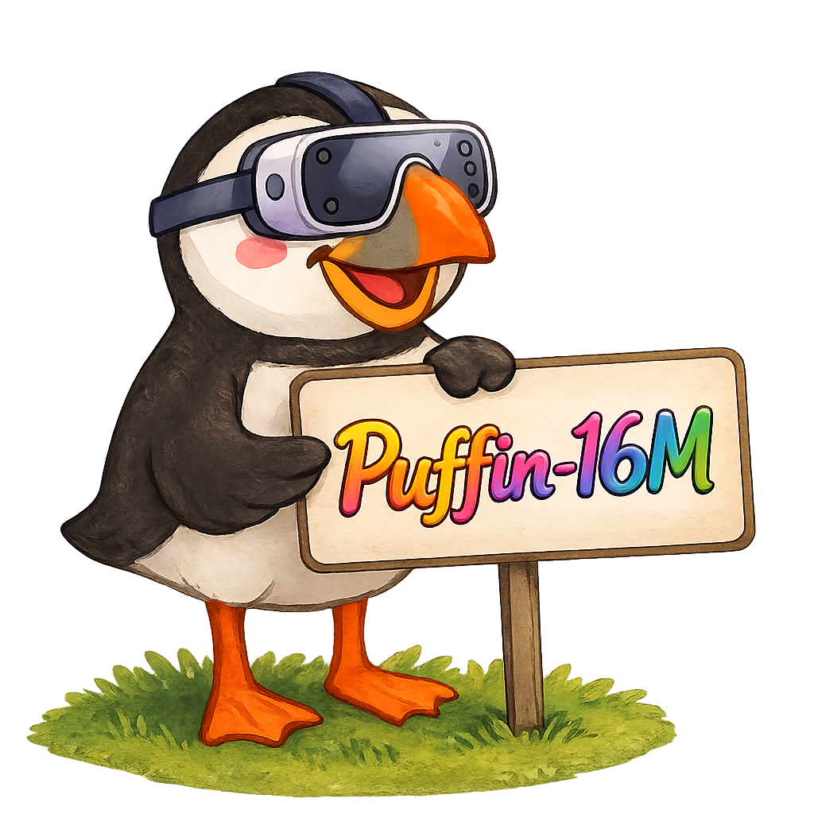

#  Construction Pipeline of Puffin-16M Dataset

End-to-end pipeline that turns raw 360° panoramas into annotated perspective
training data: **preprocess panoramas → render perspective images / trajectories
→ caption with VLMs → post-process into training-ready JSON + index**.

```
360° videos / Google Drive links
     │  frames_from_video.py            drive_download.sh
     ▼
raw equirectangular frames ──youtube_frames_merge.py──► flat pano folders
     │  pano_rectification.py   (2:1 ratio check + gravity alignment)
     ▼
rectified panoramas  <base_dir>/<name>/*.jpg
     │
     ├──────────────► get_caption.py --task camera_height   (labels the PANORAMAS)
     │
     │  [ switch to the geocalib env, cd dataset/generation/GeoCalib ]
     │
     ├─ create_dataset_from_pano_img.py ────────► <save_dir>/<name>/train/*.jpg + train.csv
     └─ create_dataset_from_pano_trajectory.py ─► <out_dir>/<name>/<pano>_<seg>/ + cameras.json
     │
     ▼  get_caption.py  (--task scene / filter / thinking)
caption CSVs  <output_root>/<scene>/<scene>.csv
     │  merge_caption.py   (captions ⋈ train.csv camera params)
     ▼
per-image JSON  <scene>/train_scene_cam/*.json
     │  write_summary.py
     ▼
summary.json  (image ↔ annotation index for training)
```

---

## 1. Panorama preprocessing — `dataset/preprocessing/`

### 1.1 Collect source panoramas (optional)

- **`drive_download.sh`** — batch-download panorama archives from Google Drive
  through the Drive v3 API with multi-connection `aria2c`. Edit the `FILE_URLS`
  array at the top of the script, then:

  ```bash
  GDRIVE_ACCESS_TOKEN=ya29.xxxx bash dataset/preprocessing/drive_download.sh
  ```

- **`frames_from_video.py`** — extract equirectangular frames from 360° videos
  with ffmpeg: one frame every `--i` seconds inside an optional `[--s, --e]`
  window, rescaled to 2:1 (`iw:iw/2`), saved as lossless PNGs
  `<video_name>_%08d.png`.

  ```bash
  python dataset/preprocessing/frames_from_video.py \
      --d /path/videos --o /path/frames --i 2
  ```

### 1.2 Flatten YouTube frame folders (optional)

- **`youtube_frames_merge.py`** — merge per-video frame subfolders into one flat
  directory. A `y: <int>` sidecar .txt in a subfolder blacks out all rows below
  that height (masks channel watermarks / UI bars) before moving.

  ```bash
  python dataset/preprocessing/youtube_frames_merge.py \
      --src /path/frames --dst /path/panos_flat --range 57-120
  ```

### 1.3 Gravity rectification and ratio checker (if necessary)

- **`pano_rectification.py`** — LayoutNet-style gravity alignment: LSD line
  detection → vanishing-point estimation → rotate the panorama upright.
  Before rectification each image is checked with a metadata-only read and
  **skipped if not 2:1 equirectangular** (`--check_ratio`, on by default).
  `--turbo` (default) estimates the VP on a downsampled copy and rotates at
  full resolution with tiled `cv2.remap` (constant memory, works on gigapixel
  panos); `--no-turbo` is the classic full-resolution path. Resumes by output
  existence.

  ```bash
  python dataset/preprocessing/pano_rectification.py \
      --i /path/panos_flat --o /path/panos_rectified --workers 2
  ```

---

## 2. Perspective rendering — `dataset/generation/GeoCalib/`

> ⚠️ **This stage runs inside the GeoCalib environment and from the GeoCalib
> directory** (its `siclib` package and hydra config paths are relative):
>
> ```bash
> conda activate geocalib
> cd dataset/generation/GeoCalib
> ```
>
> First-time setup (`siclib` install, OpenPano reference, evaluation/training
> of GeoCalib itself): see [dataset/generation/GeoCalib/README.md](../dataset/generation/GeoCalib/README.md).

Configs live in `siclib/datasets/configs/`; every field can be overridden on
the hydra command line (`name=... base_dir=... num_panos=... device=cuda:0`).

### 2.1 Single perspective images — `siclib/datasets/create_dataset_from_pano_img.py`

Per panorama, sample `images_per_pano` yaws uniformly around the circle; per
view, sample roll/pitch (uniform ±45°), vfov (uniform 20–105°), and the output
shape (`custom_resolution_640`: mixed 1:1 / 4:3 / 3:2 / 16:9 at 640 base, both
orientations). Views with >1% black pixels are discarded; existing outputs are
skipped unless `overwrite=true`.

```bash
# pinhole (config: pano_img.yaml — name, base_dir, save_dir, num_panos, ...)
python -m siclib.datasets.create_dataset_from_pano_img --config-name pano_img \
    name=360Pano n_workers=4 device=cuda:0

# radial distortion (config: pano_img_radial.yaml — camera_model=simple_radial,
# k1_hat ~ truncnorm applied with prob 0.9; focal auto-raised so the distorted
# image still covers the full sensor)
python -m siclib.datasets.create_dataset_from_pano_img --config-name pano_img_radial
```

Output layout (consumed by stages 3–4):

```
<save_dir>/<name>/
├── train/                 # perspective JPGs  <pano_stem>_<i>.jpg
├── train.csv              # fname, roll, pitch, vfov, height, width [, k1] (radians)
├── config.yaml            # resolved config snapshot
└── distributions.pdf      # roll/pitch/vfov histograms
```

### 2.2 Perspective trajectories — `siclib/datasets/create_dataset_from_pano_trajectory.py`

Per panorama, generate M continuous camera-motion segments; each segment is
one motion type — **pitch-only** (up/down/up-down/down-up), **roll-only**
(cw/ccw/cw-ccw/ccw-cw), or **yaw-only** (right-left / left-right /
full_circle) — rendered as `images_per_segment` frames at `angle_step_deg`
per frame (default 90 frames × 1°), with vfov sampled in
`[vfov_min_deg, vfov_max_deg]`. `segments_per_motion_type=M` gives M segments
for EACH of pitch/roll/yaw; otherwise `segments_per_pano` segments with random
motion types. Multi-GPU: one generator per GPU (`n_gpus`), `workers_per_gpu`
panos in flight per GPU.

```bash
python -m siclib.datasets.create_dataset_from_pano_trajectory \
    --config-name pano_trajectory name=360swiss_8 n_gpus=4 workers_per_gpu=4
```

Output layout:

```
<out_dir>/<name>/
├── config.yaml
└── <pano_stem>_<seg:06d>/          # one folder per segment
    ├── 000001.jpg ... 000090.jpg   # perspective frames
    ├── cameras.json                # per-frame roll/pitch/yaw (deg), vfov, K,
    │                               # 4x4 c2w poses (DL3DV-style) + motion metadata
    └── <segment>.mp4               # only when save_video=true
```

---

## 3. VLM captioning — `dataset/caption/get_caption.py`

One unified multi-GPU labelling script; `--task` selects the task-model-prompt
preset and any CLI flag overrides it. Data-parallel: one process per GPU
(`--gpus N`), results merged into one CSV per scene:
`<output_root>/<scene>/<scene>[_<start>_<end>].csv` with columns
`num, file_name, label`.

Note the inputs differ per task: `scene` / `filter` / `thinking` label the
**rendered perspective images** from stage 2, while `camera_height` labels the
**equirectangular panoramas themselves** (stage 1 output, before rendering).

| `--task` | model (default) | input | what it labels |
|---|---|---|---|
| `scene` | Qwen2.5-VL-7B-Instruct | perspectives `<scene>/train/` | 1–2 sentence scene caption |
| `filter` | Qwen2.5-VL-7B-Instruct | perspectives `<scene>/train/` | low-quality flag `0/1` (faces, low-info, artifacts, watermarks) |
| `camera_height` | Qwen3-VL-32B-Instruct | **panoramas** `<pano_root>/<scene>/` (no `train/` nesting; resized to 640×320) | 5-class height label (underwater / low / eye-level / high / aerial) |
| `thinking` | Qwen3-VL-32B-Instruct | perspectives `<scene>/train/` + `train.csv` | `<think>` reasoning paragraph, prompt built per image from roll/pitch/vfov/k1 (needs stage 2.1 output) |

```bash
# scene captions for every rendered dataset
python dataset/caption/get_caption.py --task scene --gpus 4 --folders ALL

# quality filter for two scenes
python dataset/caption/get_caption.py --task filter --folders OmniPhotos OmniBlender

# camera height on the SOURCE PANORAMAS (input_root is the pano root, not Projection/)
python dataset/caption/get_caption.py --task camera_height \
    --input_root /data/360_dataset --folders ALL

# thinking captions, split into ranges for parallel jobs
# (each job writes <scene>_<start>_<end>.csv; resume-friendly)
python dataset/caption/get_caption.py --task thinking \
    --folders OmniPhotos --start_idx 0 --end_idx 2000
```

`--model_id / --model_type (moe|qwen3|qwen2p5) / --model_root / --prompt /
--input_root / --output_root / --max_new_tokens` all override the preset.

---

## 4. Post-processing — `dataset/postprocessing/`

### 4.1 Merge captions with camera parameters — `merge_caption.py`

Joins `path_a/<scene>/train.csv` (camera params from stage 2.1) with the
caption CSV in `path_b/<scene>/` by filename and writes one JSON per image to
`path_a/<scene>/<folder_target>/<stem>.json`. When several CSVs exist in a
scene folder it prefers `<scene>.csv`.
```bash
# plain captions:  "<caption> The camera parameters (roll, pitch,
#                   field-of-view, and radial distortion) are: r, p, v, k."
python dataset/postprocessing/merge_caption.py \
    --path_a /path/Projection --path_b /path/captions/scenes

# thinking format: "<think> ... </think><answer>r, p, v, k</answer>"
python dataset/postprocessing/merge_caption.py --thinking \
    --path_a /path/Projection --path_b /path/captions/thinking \
    --folder_target train_thinking_cam --write_size
```

`--write_size` additionally embeds `width`/`height` from `train.csv` into each
JSON.

### 4.2 Build the training index — `write_summary.py`

Matches images in `<scene>/train/` with the annotation JSONs from 4.1 by stem
and writes `summary.json` (list of `{"image", "annotation"}` relative-path
records) under `--root_path`. Optional filters: `--gen_unit 16` keeps only
images whose sides are divisible by 16 (generation requirement);
`--aspect_ratios "1:1" "4:3"` whitelists aspect ratios.

```bash
python dataset/postprocessing/write_summary.py \
    --root_path /path/Projection \
    --annot_folder train_scene_cam --gen_unit 16 \
    --excluded_folders OmniBlender --output summary.json
```

---

## Typical full run

```bash
# 1. preprocess (puffin-world env)
python dataset/preprocessing/pano_rectification.py --i /data/panos_raw --o /data/360_dataset/MyPanos

# 2. render (geocalib env, inside GeoCalib/)
conda activate geocalib && cd dataset/generation/GeoCalib
python -m siclib.datasets.create_dataset_from_pano_img --config-name pano_img \
    name=MyPanos base_dir=/data/360_dataset save_dir=/data/Projection
cd ../../.. && conda deactivate

# 3. caption (VLM env)
python dataset/caption/get_caption.py --task scene  --gpus 8 --input_root /data/Projection --folders MyPanos
python dataset/caption/get_caption.py --task filter --gpus 8 --input_root /data/Projection --folders MyPanos

# 4. post-process
python dataset/postprocessing/merge_caption.py --path_a /data/Projection --path_b /data/captions/scenes
python dataset/postprocessing/write_summary.py --root_path /data/Projection
```
