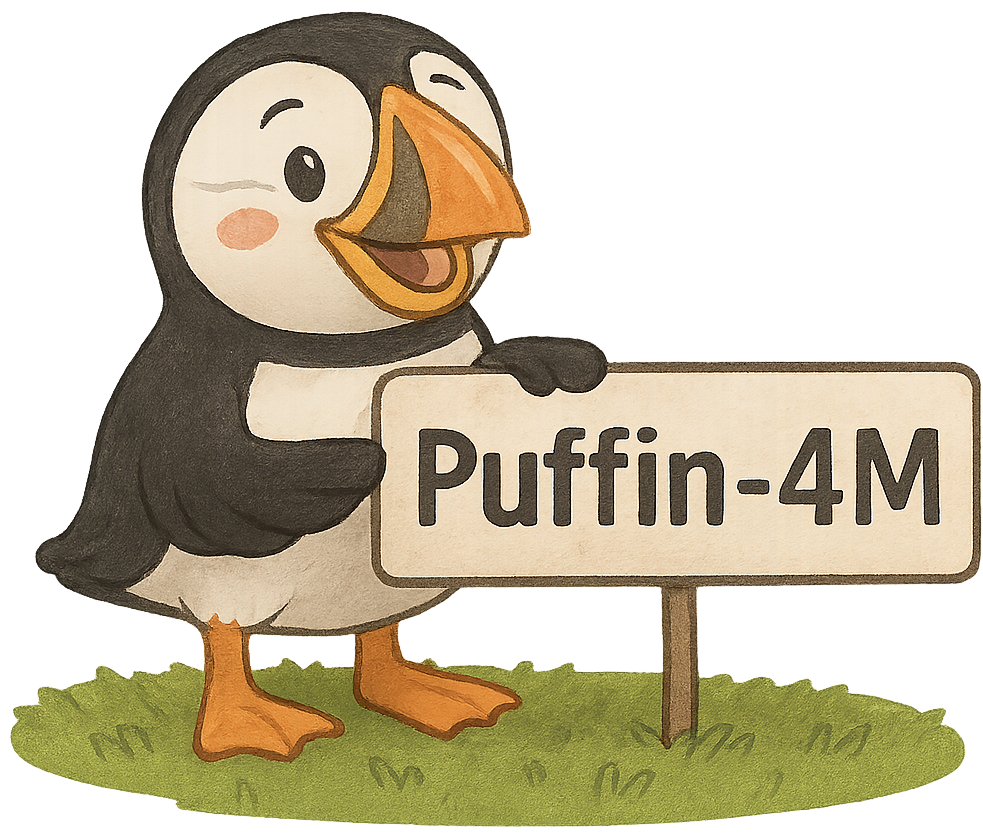

<h1>
  
  Thinking with Camera: A Unified Multimodal Model for Camera-Centric Understanding and Generation
</h1>

<p align="center">
  
</p>

> **[Thinking with Camera: A Unified Multimodal Model for Camera-Centric Understanding and Generation](https://arxiv.org/abs/2510.08673)**
>
> [Kang Liao](https://kangliao929.github.io/), [Size Wu](https://wusize.github.io/), [Zhonghua Wu](https://wu-zhonghua.github.io/), [Linyi Jin](https://jinlinyi.github.io/), [Chao Wang](https://hans1984.github.io/), [Yikai Wang](https://yikai-wang.github.io/), [Fei Wang](https://scholar.google.com/citations?user=ljt16JkAAAAJ&hl), [Wei Li](https://weivision.github.io/), [Chen Change Loy](https://www.mmlab-ntu.com/person/ccloy/index.html)

>
> [](https://arxiv.org/abs/2510.08673)
> [](https://kangliao929.github.io/projects/puffin/)
> [](https://huggingface.co/KangLiao/Puffin)
> [](https://huggingface.co/datasets/KangLiao/Puffin-4M)
> [](https://huggingface.co/spaces/KangLiao/Puffin)

## Introduction

We make the first attempt to seamlessly integrate camera geometry into a unified multimodal model, introducing a camera-centric framework, <em>i.e.</em>, **Puffin**, to advance multimodal spatial intelligence.

## 📝 Changelog & News

- [x] 2025.10.10: The paper, project page, code, model, dataset, and demo of Puffin are online.
- [x] 2026.01.10: The scripts of the camera-centric evaluation has been released.
- [ ] Release the scripts of the dataset construction pipeline.
- [ ] Release the camera caption (by our method) of the commonly used large-scale text-to-image datasets, such as megalith-10m.


## 🖥️ Requirements and Installation
The code has been implemented with PyTorch 2.7.0 and CUDA 12.6.

An example of installation commands is provided as follows:

```
# git clone this repository
git clone https://github.com/KangLiao929/Puffin
cd Puffin

# create new anaconda env
conda create -n Puffin python=3.10
conda activate Puffin

# install python dependencies
pip install torch==2.7.0 torchvision==0.22.0 --index-url https://download.pytorch.org/whl/cu124
pip install -r requirements.txt
```

## 🏂 Demo & Quick Inference
We release three model variants: Puffin-Base, Puffin-Thinking, and Puffin-Instruct, to accommodate different application needs. Puffin-Base provides a foundation model for unified camera-centric understanding and generation; Puffin-Thinking enhances spatial reasoning and generation by thinking with camera; and Puffin-Instruct is optimized by instruction tuning, supporting cross-view tasks and complex multimodal interactions.

Download the model checkpoints from 🤗 [KangLiao/Puffin](https://huggingface.co/KangLiao/Puffin) and organize them as follows:
```text
Puffin/
├── checkpoints
    ├── Puffin-Align.pth # provided for customized SFT
    ├── Puffin-Base.pth
    ├── Puffin-Thinking.pth
    ├── Puffin-Instruct.pth
```
It is recommended to use the following command to download the checkpoints
```bash
# pip install -U "huggingface_hub[cli]"
huggingface-cli download KangLiao/Puffin  --local-dir checkpoints --repo-type model
```

<h3>
  
  Camera-controllable Image Generation
</h3>

The generated images can be obtained by text prompts and camera prompts (roll: ```-r```, pitch: ```-p```, vertical field-of-view: ```-f```, all in radius) using the following command:

```shell
export PYTHONPATH=./:$PYTHONPATH
python scripts/demo/generation.py configs/pipelines/stage_2_base.py \
          --checkpoint checkpoints/Puffin-Base.pth --output generation_result.jpg \
          --prompt "A streetlamp casts light on an outdoor mural with intricate floral designs and text, set against a building wall." \
          -r -0.3939 -p 0.0277 -f 0.7595
```

To enable the thinking mode of image generation, please simply change the settings and append ```--thinking``` flag:

```shell
python scripts/demo/generation.py configs/pipelines/stage_3_thinking.py \
          --checkpoint checkpoints/Puffin-Thinking.pth --output generation_result_thinking.jpg \
          --prompt "A streetlamp casts light on an outdoor mural with intricate floral designs and text, set against a building wall." \
          -r -0.3939 -p 0.0277 -f 0.7595 \
          --thinking
```

<h3>
  
  Camera Understanding
</h3>

The camera understanding results (scene descriptions and camera parameters) can be obtained using the following command:

```shell
python scripts/demo/understanding.py configs/pipelines/stage_2_base.py \
          --checkpoint checkpoints/Puffin-Base.pth --image_path assets/test_img/test.jpg \
          --save_dir vis_results/
```
The visualization results (pixel-wise camera maps) can also be found at ```--save_dir```.

Like the camera-controllable generation, the thinking mode can be enabled by changing the settings and append ```--thinking``` flag:

```shell
python scripts/demo/understanding.py configs/pipelines/stage_3_thinking.py \
          --checkpoint checkpoints/Puffin-Thinking.pth --image_path assets/test_img/test.jpg \
          --save_dir vis_results/ \
          --thinking
```

<h3>
  
  World Exploration
</h3>

The generated target view can be obtained by an initial view and camera prompts (roll: ```-r```, pitch: ```-p```, yaw: ```-y```, all in radius) using the following command:

```shell
python scripts/demo/world_exploration.py configs/pipelines/stage_4_instruction_tuning.py \
          --checkpoint checkpoints/Puffin-Instruct.pth --init_image assets/test_img/test_cross_view.jpg \
          --output world_exploration_result.jpg \
          -r 0.1 -p -0.1 -y 0.2
```

The above process can be applied to the 3D world generation (*e.g.*, Figure A8 in the paper) like world models, the multi-view results are generated around an initial view:

```shell
python scripts/demo/world_exploration_3D.py configs/pipelines/stage_4_instruction_tuning.py \
          --checkpoint checkpoints/Puffin-Instruct.pth --init_view_path assets/test_img/ \
          --output world_exploration_3D/
```


<h3>
  
  Spatial Imagination
</h3>
Given an initial view and the expected location (left, behind, and right), Puffin can imagine the scene description of the target view using the following command:

```shell
python scripts/demo/spatial_imagination.py configs/pipelines/stage_4_instruction_tuning.py \
          --checkpoint checkpoints/Puffin-Instruct.pth --image assets/test_img/test_cross_view.jpg \
          --location behind
```

<h3>
  
  Photographic Guidance
</h3>
Puffin can suggest camera parameter adjustments from an initial view to achieve images with higher photographic aesthetics. The deviation (pitch and yaw) between the target image and initial image can be obtained using the following command:

```shell
python scripts/demo/photographic_guidance.py configs/pipelines/stage_4_instruction_tuning.py \
          --checkpoint checkpoints/Puffin-Instruct.pth --image assets/test_img/test_cross_view.jpg
```


<h2>
  
  Puffin-4M Dataset
</h2>

Datasets and benchmarks that span vision, language, and camera modalities remain scarce in the domain of spatial multimodal intelligence. To address this gap, we introduce <strong>Puffin-4M</strong>, a large-scale, high-quality dataset comprising 4 million vision-language-camera triplets. We release the training data and evaluation benchmark in 🤗 [KangLiao/Puffin-4M](https://huggingface.co/datasets/KangLiao/Puffin-4M). The whole dataset is approximately **449GB** in size. Note that we omit the camera maps from the uploaded training data due to their large total size (~3 MB each, amounting to ~11.4 TB in total). However, these maps can be easily generated from the captions using the following command:

```shell
python scripts/camera/cam_dataset.py \
          --input_root Puffin-4M/training_data/cap_folder \
          --output_root Puffin-4M/training_data/cam_folder
```

The scripts of the construction pipeline for our Puffin-4M will be updated in [Dataset Pipeline](documents/DATASET_PIPELINE.md) soon.


## ✈️ Training
We conduct a multi-stage training strategy, where the vision encoder, LLM, and the diffusion model are aligned in the first stage. Then, in the SFT stage, the models are jointly optimized using both base and thinking datasets. Finally, an instruction-tuning stage is applied, involving various cross-view generation and understanding tasks. The implementation details are provided in [Training](documents/TRAINING.md).

## 🖼️ Evaluation
We evaluate our camera-centric generation and understanding performance on public datasets and our constructed benchmark (🤗 [KangLiao/Puffin-4M/benchmark](https://huggingface.co/datasets/KangLiao/Puffin-4M/tree/main/benchmark)). 

For camera understanding, we conduct evaluations on three common datasets, MegaDepth, TartanAir, and LaMAR. Notably, images from these datasets are primarily captured or simulated in well-structured environments. Moreover, the camera parameters in some datasets are limited in distribution. To complement these settings, we construct a more challenging dataset, Puffin-<em>Und</em>, designed for a comprehensive assessment of camera understanding. This dataset contains 1,000 images spanning diverse camera configurations and scenarios (🤗 [KangLiao/Puffin-4M/benchmark/Puffin-Und](https://huggingface.co/datasets/KangLiao/Puffin-4M/tree/main/benchmark/Puffin-Und)). Additionally, since no benchmark dataset exists for text-to-image generation with precise camera parameters, we construct Puffin-<em>Gen</em> to fill this gap. The dataset consists of 650 caption–camera pairs spanning diverse scenarios and camera configurations (🤗 [KangLiao/Puffin-4M/benchmark/Puffin-Gen](https://huggingface.co/datasets/KangLiao/Puffin-4M/tree/main/benchmark/Puffin-Gen)). The evaluation details are provided in [Evaluation](documents/EVALUATION.md).


## 📚 Citation

If you find Puffin useful for your research or applications, please cite our paper using the following BibTeX:

```bibtex
  @article{liao2025puffin,
    title={Thinking with Camera: A Unified Multimodal Model for Camera-Centric Understanding and Generation},
    author={Liao, Kang and Wu, Size and Wu, Zhonghua and Jin, Linyi and Wang, Chao and Wang, Yikai and Wang, Fei and Li, Wei and Loy, Chen Change},
    journal={arXiv preprint arXiv:2510.08673},
    year={2025}
  }
```

## 🗞️ License
This project is licensed under [NTU S-Lab License 1.0](LICENSE).


## 🙏 Acknowledgement
The project builds upon [OpenUni](https://github.com/wusize/OpenUni), [MetaQuery](https://github.com/facebookresearch/metaquery), [Qwen2.5](https://github.com/QwenLM/Qwen2.5), [RADIOv3](https://huggingface.co/nvidia/C-RADIOv3-L), [SD3](https://huggingface.co/stabilityai/stable-diffusion-3-medium), and [GeoCalib](https://github.com/cvg/GeoCalib).