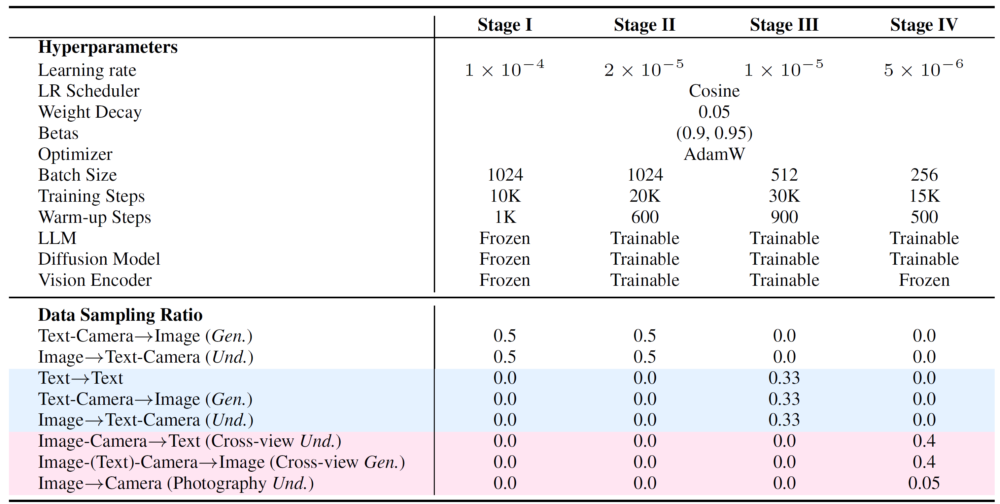

## ✈️ Training


### Stage I-Alignment
In this stage, we align the vision encoder with the LLM by training only the MLP projector for the understanding task, where the framework learns to predict both text descriptions and camera parameters from the input image. For generation, the framework takes text descriptions, camera parameters, and the camera map as inputs, and learns to synthesize the target image with the corresponding description and configuration. Specifically, we train learnable queries and a connector to bridge the LLM and the diffusion transformer, where the connector maps LLM hidden states into conditioning signals for the diffusion model.

To conduct the alignment pre-training, please customize the config path and run:
```shell
cd /path/to/Puffin
export PYTHONPATH=./:$PYTHONPATH
bash scripts/train_ddp.sh configs/pipelines/stage_1_alignment.py
```

The model weights will be saved at ```work_dir/stage_1_alignment/```.

### Stage II-SFT
After aligning different modalities, we unfreeze all modules except the VAE and fine-tune the entire framework, using the same inputs and outputs as in Stage I.

To conduct the SFT, please customize the pre-trained model weights from Stage-I and the config path, and run:
```shell
cd /path/to/Puffin
export PYTHONPATH=./:$PYTHONPATH
bash scripts/train_ddp.sh configs/pipelines/stage_2_base.py  # uncomment model.pretrained_pth = 'work_dirs/stage_1_alignment/iter_10000.pth'
```

The model weights will be saved at ```work_dir/stage_2_base/```.

### Stage III-SFT with Thinking
To further bridge the modality gap between the camera and vision-language, we introduce thinking with camera in this stage. The implementation is the same as Stage-II, except that the training data contains spatial reasoning captions. Beyond generation and understanding, this stage also learns the textual reasoning task, which enriches the vanilla captions with spatially grounded visual cues and translates specific camera parameter values into professional photographic terms.

To conduct the SFT with thinking, please customize the pre-trained model weights from Stage-II and the config path, and run:
```shell
cd /path/to/Puffin
export PYTHONPATH=./:$PYTHONPATH
bash scripts/train_ddp.sh configs/pipelines/stage_3_thinking.py  # uncomment model.pretrained_pth = 'work_dirs/stage_2_base/iter_30000.pth'
```

The model weights will be saved at ```work_dir/stage_3_thinking/```.


### Stage IV-Instruction Tuning
Finally, we improve our model’s ability to adapt to diverse spatial configurations. In particular, three types of cross-view data are trained simultaneously, including the spatial imagination, world exploration, and photographic guidance.

To conduct the instruction tuning, please customize the pre-trained model weights from Stage-II and the config path, and run:
```shell
cd /path/to/Puffin
export PYTHONPATH=./:$PYTHONPATH
bash scripts/train_ddp.sh configs/pipelines/stage_4_instruction_tuning.py  # uncomment model.pretrained_pth = 'work_dirs/stage_2_base/iter_30000.pth'
```

The model weights will be saved at ```work_dir/stage_4_instruction_tuning/```. The detailed training recipe of Puffin is shown as follows.

<p align="center">
  
</p>
<p align="center" style="margin-top:4px;color:#666;font-size:14px;">
  Training recipe of Puffin. For the data sampling ratio, we mark the data involving the spatial reasoning and instruction tuning in light blue and light red, respectively. For clarity, we abbreviate the generation and understanding as <em>Gen.</em> and <em>Und.</em>.
</p>